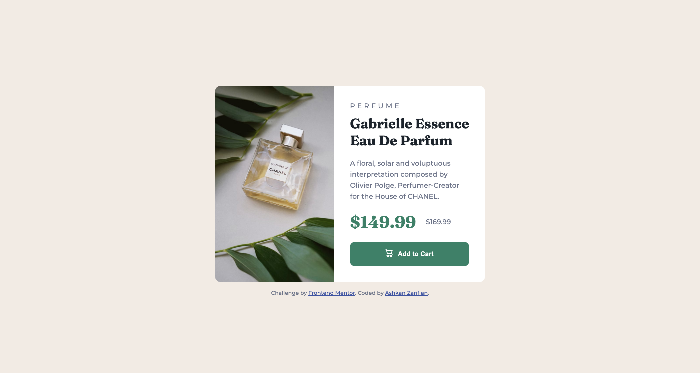

# Frontend Mentor - Product preview card component solution

This is a solution to the [Product preview card component challenge on Frontend Mentor](https://www.frontendmentor.io/challenges/product-preview-card-component-GO7UmttRfa). Frontend Mentor challenges help you improve your coding skills by building realistic projects.

## Table of contents

- [Overview](#overview)
  - [The challenge](#the-challenge)
  - [Screenshot](#screenshot)
  - [Links](#links)
- [My process](#my-process)
  - [Built with](#built-with)
  - [What I learned](#what-i-learned)
- [Author](#author)

## Overview

### The challenge

Users should be able to:

- View the optimal layout depending on their device's screen size
- See hover and focus states for interactive elements

### Screenshot



### Links

- Solution URL: [Solution URL here](https://www.frontendmentor.io/solutions/product-preview-card-component-HkcKs4DLBd)
- Live URL: [Solution URL here](https://aesthetic-tiramisu-42cc46.netlify.app/)

## My process

### Built with

- Semantic HTML5 markup
- CSS custom properties
- Flexbox
- Mobile-first workflow

### What I learned

I use image tag with srcset attribute it was very useful for responsive design, you can use it like this:

```html

<!-- the first image shows for desktop and
     second on shows for width lower than 500px(mobile and tablet) -->
```

## Author

- Frontend Mentor - [@ashkan-zs](https://www.frontendmentor.io/profile/ashkan-zs)
